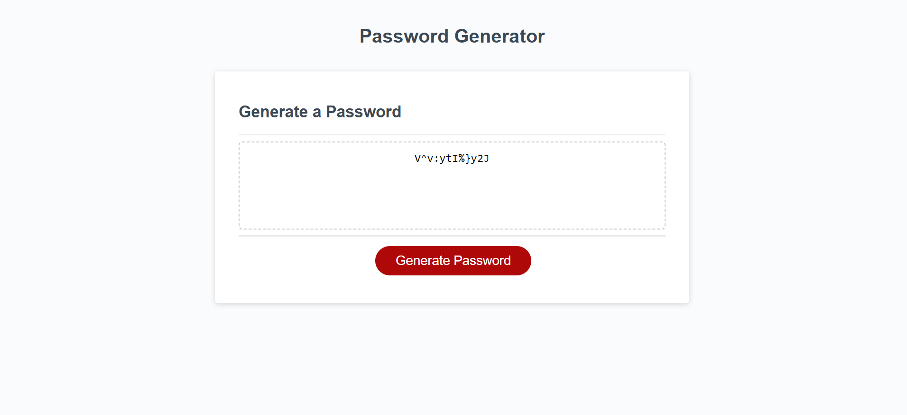

# Password Generator (module 3 challenge)

## Link to website: https://wasmunlb.github.io/password-generator/

## Description

Now more than ever it is important to have a strong password. In the article "Impressive Password Statistics to Know in 2022" by webtribunal.net, 90% of passwords are vulnerable to attack. Some of this is due to users choosing simple and easy-to-remember passwords. Also, reusing the same password for multiple sites leaves people extremely vulnerable. With my website, users can generate a secure password easily. 

As a student, I learned a lot from building this website. I learned how to combine arrays based on the requirements for the password the user needs. Before I learned the concat function in JS, I was planning on building 16 different arrays to cover each option for the requirements. This was a solution to the problem but would have been far too tedious to implement. 

Another great lesson I learned was based on a bug I was getting. Initially, my generated passwords would all be the same character, which is neither secure nor would it meet password requirements from the user. This bug existed because the random number generator I created was outside of the for-loop that generated the password. So as the function ran, only one random character was generated instead of being reiterated in the for-loop.

## Usage

To use this site, all the user needs to do is:
-Click on the "Generate Password" button.
-A prompt box appears asking how many characters (between 8-128), and whether or not the users password requires numbers, upper/lower case, and special characters.
-Once the questions are answered, a random and secure password appears that the user may copy onto their clipboard. Attached are images to support usage.

## License

The MIT licence was used for this site.